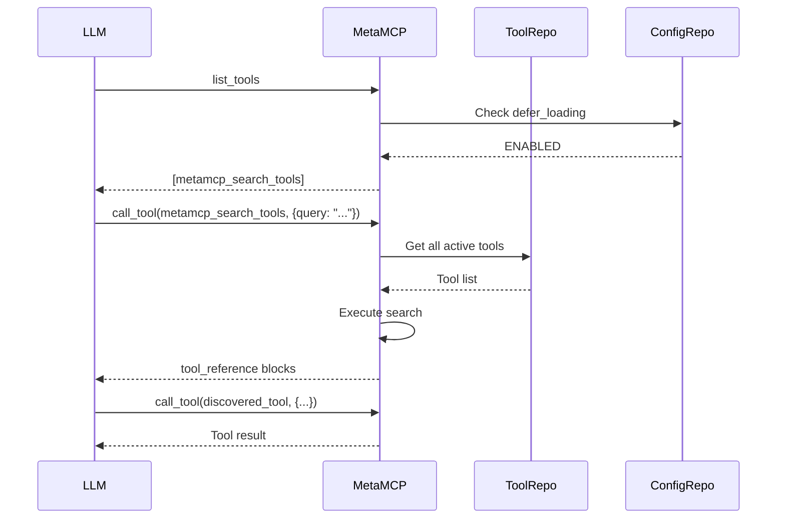

**Tool Search** is MetaMCP's built-in feature that enables dynamic tool discovery for large namespaces. Instead of loading all tools upfront, LLMs can search for relevant tools on-demand, optimizing context window usage and improving tool selection accuracy.

## What is Tool Search?

Tool Search provides a `metamcp_search_tools` built-in tool that accepts a search query and returns matching tools. This enables:

- **Dynamic tool discovery**: LLMs find relevant tools only when needed
- **Reduced context usage**: Load only relevant tools instead of hundreds at once
- **Better tool selection**: Search filters tools by relevance to the current task
- **Scalable namespaces**: Manage large tool collections without overwhelming context

## How Tool Search Works

<Steps>
  <Step title="Configure defer-loading">
    Enable defer-loading in your namespace or endpoint settings to activate tool search mode
  </Step>

  <Step title="LLM receives metamcp_search_tools">
    When defer-loading is enabled, only the `metamcp_search_tools` tool is initially available
  </Step>

  <Step title="LLM searches for tools">
    The LLM calls `metamcp_search_tools` with a query describing needed functionality
  </Step>

  <Step title="MetaMCP returns matching tools">
    MetaMCP searches available tools and returns matches as `tool_reference` blocks
  </Step>

  <Step title="LLM uses discovered tools">
    The LLM can now call the discovered tools via `tool_use` blocks
  </Step>
</Steps>

## The metamcp_search_tools Tool

The built-in search tool accepts two parameters:

| Parameter | Type | Required | Description |
|-----------|------|----------|-------------|
| `query` | string | Yes | Search query describing the needed tool functionality |
| `max_results` | number | No | Maximum number of results to return (defaults to namespace config) |

### Example Usage

```json
{
  "tool": "metamcp_search_tools",
  "arguments": {
    "query": "read files from filesystem",
    "max_results": 3
  }
}
```

### Response Format

The tool returns `tool_reference` blocks (Anthropic's extension to MCP):

```json
{
  "content": [
    {
      "type": "tool_reference",
      "tool": {
        "name": "filesystem__read_file",
        "description": "Read contents from a file",
        "inputSchema": { /* ... */ }
      }
    },
    {
      "type": "tool_reference",
      "tool": {
        "name": "filesystem__list_directory",
        "description": "List files in a directory",
        "inputSchema": { /* ... */ }
      }
    }
  ]
}
```

## Defer-Loading Behavior

Control when tools are loaded with three defer-loading modes:

<AccordionGroup>
  <Accordion icon="circle-xmark" title="DISABLED (Default)">
    Traditional behavior - all tools are loaded upfront in `list_tools` responses.

    **Use when:**
    - Namespace has few tools (< 20)
    - You want all tools immediately available
    - LLM needs to see full tool catalog
  </Accordion>

  <Accordion icon="circle-check" title="ENABLED">
    Only `metamcp_search_tools` is available initially. LLM must search to discover other tools.

    **Use when:**
    - Namespace has many tools (> 50)
    - Tools are specialized for specific tasks
    - Context window optimization is critical
  </Accordion>

  <Accordion icon="arrow-down" title="INHERIT">
    Inherit defer-loading behavior from parent namespace.

    **Use when:**
    - Configuring endpoints that should match namespace behavior
    - Want centralized control at namespace level
  </Accordion>
</AccordionGroup>

## Configuration

### Namespace-Level Configuration

Configure tool search behavior for an entire namespace:

1. **Navigate** to your namespace in the MetaMCP dashboard
2. **Click** the "Tool Search Config" tab
3. **Configure** search settings:
   - **Defer Loading**: Choose DISABLED, ENABLED, or INHERIT
   - **Search Method**: Select search algorithm (REGEX, BM25, EMBEDDINGS)
   - **Max Results**: Default maximum results (1-20, default: 5)
   - **Provider Config**: JSON configuration for search provider

<Frame>
  
</Frame>

### Endpoint-Level Override

Endpoints can override namespace settings:

1. **Navigate** to your endpoint settings
2. **Override** defer-loading behavior if needed
3. **Keep INHERIT** to use namespace configuration

### Configuration Hierarchy

```
Endpoint Override → Namespace Config → Global Default
```

If an endpoint specifies defer-loading, it takes precedence. Otherwise, the namespace configuration is used.

## Search Methods

MetaMCP supports multiple search algorithms (extensible architecture):

<CardGroup cols={2}>
  <Card title="REGEX (Current)" icon="magnifying-glass">
    Pattern-based matching on tool names and descriptions. Fast and simple for basic queries.
  </Card>

  <Card title="BM25 (Coming Soon)" icon="text">
    Full-text search with relevance scoring. Better for natural language queries.
  </Card>

  <Card title="EMBEDDINGS (Coming Soon)" icon="brain">
    Semantic search using vector embeddings. Understands intent and context.
  </Card>

  <Card title="NONE" icon="circle-xmark">
    Disable search entirely. All tools loaded upfront (same as defer-loading: DISABLED).
  </Card>
</CardGroup>

### Provider Configuration

Each search method can have custom configuration stored in `provider_config`:

<CodeGroup>
```json REGEX
{
  "pattern": ".*file.*",
  "flags": "i"
}
```

```json BM25 (Future)
{
  "k1": 1.5,
  "b": 0.75,
  "fields": ["name", "description", "title"]
}
```

```json EMBEDDINGS (Future)
{
  "model": "text-embedding-3-small",
  "similarity_threshold": 0.7
}
```
</CodeGroup>

## Use Cases

<AccordionGroup>
  <Accordion icon="database" title="Large Tool Catalogs">
    **Scenario**: Namespace aggregates 5 MCP servers with 200+ total tools

    **Solution**: Enable defer-loading to expose only `metamcp_search_tools` initially. LLM searches for specific functionality as needed.

    **Benefit**: Reduces context from 200+ tool definitions to ~5-10 relevant tools per task.
  </Accordion>

  <Accordion icon="filter" title="Specialized Tool Collections">
    **Scenario**: Namespace contains tools for multiple unrelated domains (DevOps, Data Science, Web)

    **Solution**: Enable tool search so LLM only sees tools relevant to current task.

    **Benefit**: Improves tool selection accuracy by filtering out irrelevant options.
  </Accordion>

  <Accordion icon="gauge" title="Context Window Optimization">
    **Scenario**: Working with models that have limited context windows

    **Solution**: Use defer-loading to minimize upfront tool loading.

    **Benefit**: Preserves context space for actual conversation and task execution.
  </Accordion>

  <Accordion icon="zap" title="Faster Initial Connection">
    **Scenario**: Namespace with many slow-to-load MCP servers

    **Solution**: Enable defer-loading to skip initial tool synchronization.

    **Benefit**: Reduces time-to-first-response for the MCP connection.
  </Accordion>
</AccordionGroup>

## Best Practices

<CardGroup cols={2}>
  <Card title="Start Small" icon="seedling">
    Test defer-loading with a small namespace first to understand behavior before applying to production endpoints.
  </Card>

  <Card title="Monitor Search Quality" icon="chart-line">
    Review search queries and results to tune `max_results` and search method configuration.
  </Card>

  <Card title="Use INHERIT for Endpoints" icon="link">
    Set defer-loading at namespace level and use INHERIT for endpoints to centralize configuration.
  </Card>

  <Card title="Document Tool Descriptions" icon="book-open">
    Good tool descriptions improve search accuracy. Ensure upstream MCP servers have clear, descriptive tool metadata.
  </Card>
</CardGroup>

## Limitations

<Warning>
**Current Limitations:**

- **Search Method**: Only REGEX pattern matching is currently implemented
- **Client Support**: `tool_reference` blocks are an Anthropic extension. Verify your MCP client supports them.
- **Search Scope**: Searches only active tools within the namespace
- **No Caching**: Each search query re-evaluates all tools (caching planned for future)
</Warning>

## Architecture Details

For developers interested in the technical implementation:

### Database Schema

Tool search configuration is stored in the `tool_search_config` table:

```sql
CREATE TABLE tool_search_config (
  uuid UUID PRIMARY KEY,
  namespace_uuid UUID NOT NULL REFERENCES namespaces(uuid),
  provider_config JSONB,
  max_results INTEGER DEFAULT 5,
  created_at TIMESTAMP,
  updated_at TIMESTAMP
);
```

The `namespaces` and `endpoints` tables have:
- `defer_loading` enum: DISABLED | ENABLED | INHERIT
- `search_method` enum: NONE | REGEX | BM25 | EMBEDDINGS

### Implementation Files

| File | Purpose |
|------|---------|
| `src/lib/metamcp/builtin-tools/tool-search-tool.ts` | Core search logic and type definitions |
| `src/lib/metamcp/metamcp-proxy.ts` | Built-in tool handler integration |
| `src/db/repositories/tool-search.repo.ts` | Database access layer |
| `src/trpc/tool-search-config.impl.ts` | tRPC API endpoints |
| Frontend tool search config UI | Configuration interface |

### Data Flow



## Next Steps

<CardGroup cols={2}>
  <Card title="Namespaces" icon="package" href="/en/concepts/namespaces">
    Learn about namespace management and tool organization
  </Card>

  <Card title="Endpoints" icon="globe" href="/en/concepts/endpoints">
    Configure public endpoints with tool search enabled
  </Card>

  <Card title="Middleware" icon="filter" href="/en/concepts/middleware">
    Combine tool search with middleware for advanced workflows
  </Card>

  <Card title="Inspector" icon="search-code" href="/en/concepts/inspector">
    Test tool search behavior with the built-in inspector
  </Card>
</CardGroup>
